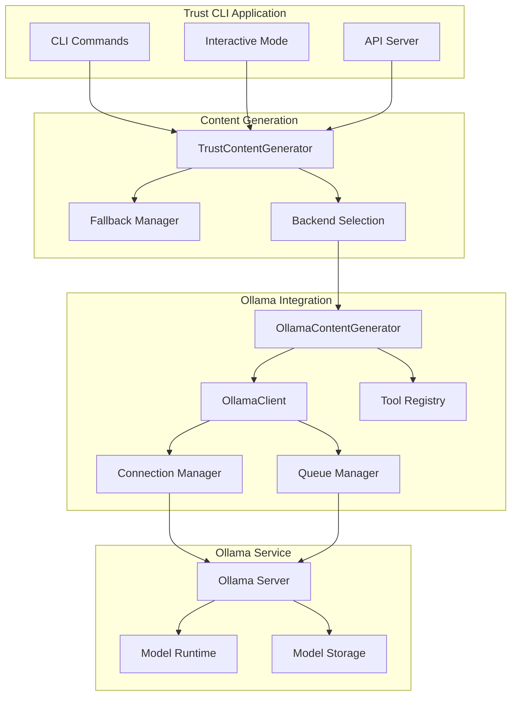
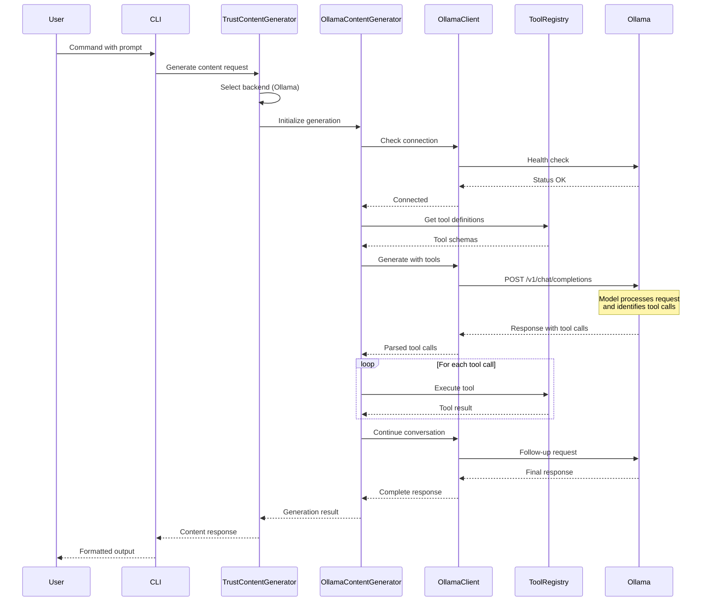
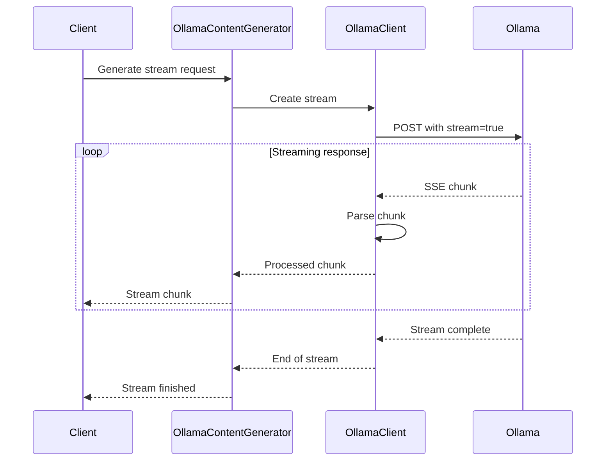
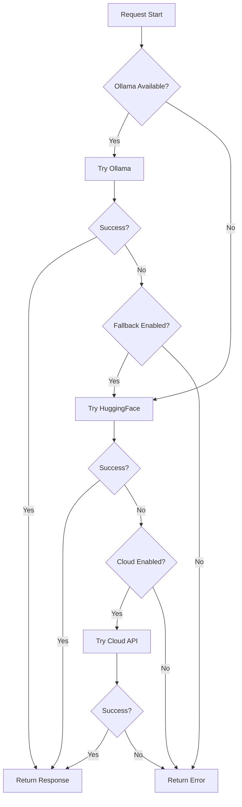

# Ollama Integration Architecture Deep Dive

> **Technical Architecture Documentation**  
> Detailed system design and implementation patterns for Trust CLI's Ollama integration

## System Architecture

### High-Level Architecture

```
┌─────────────────────────────────────────────────────────────────┐
│                        Trust CLI Application                     │
├─────────────────────────────────────────────────────────────────┤
│                                                                 │
│  ┌─────────────────┐    ┌─────────────────┐    ┌─────────────┐ │
│  │   CLI Commands  │    │  Interactive    │    │  API Server │ │
│  │                 │    │      Mode       │    │             │ │
│  └─────────┬───────┘    └─────────┬───────┘    └──────┬──────┘ │
│            │                      │                   │        │
│            └──────────────────────┼───────────────────┘        │
│                                   │                            │
│  ┌─────────────────────────────────┼─────────────────────────┐  │
│  │           Core Content Generation Layer                  │  │
│  │                                                          │  │
│  │  ┌─────────────────────────────────────────────────────┐  │  │
│  │  │          TrustContentGenerator                      │  │  │
│  │  │                                                     │  │  │
│  │  │  ┌─────────────────┐  ┌─────────────────────────────┐│  │  │
│  │  │  │  Backend        │  │     Fallback Manager        ││  │  │
│  │  │  │  Selection      │  │                             ││  │  │
│  │  │  │                 │  │  Ollama → HuggingFace       ││  │  │
│  │  │  │                 │  │         → Cloud             ││  │  │
│  │  │  └─────────────────┘  └─────────────────────────────┘│  │  │
│  │  └─────────────────────────────────────────────────────┘  │  │
│  └─────────────────────────────────────────────────────────┘  │
│                                   │                            │
│  ┌─────────────────────────────────┼─────────────────────────┐  │
│  │              Ollama Integration Layer                    │  │
│  │                                                          │  │
│  │  ┌─────────────────┐  ┌─────────────────┐  ┌────────────┐│  │
│  │  │OllamaContent    │  │  OllamaClient   │  │  Tool      ││  │
│  │  │Generator        │  │                 │  │  Registry  ││  │
│  │  │                 │  │  • Connection   │  │            ││  │
│  │  │• Conversation   │  │    Pool         │  │• Schema    ││  │
│  │  │  Management     │  │  • Request      │  │  Conversion││  │
│  │  │• Tool Calling   │  │    Queue        │  │• Execution ││  │
│  │  │• Streaming      │  │  • Health       │  │• Validation││  │
│  │  │• Error Recovery │  │    Checks       │  │            ││  │
│  │  └─────────────────┘  └─────────────────┘  └────────────┘│  │
│  └─────────────────────────────────────────────────────────┘  │
│                                   │                            │
├─────────────────────────────────────────────────────────────────┤
│                     Network Layer                              │
│                                                                 │
│  ┌─────────────────┐    ┌─────────────────┐    ┌─────────────┐ │
│  │   HTTP Client   │    │   WebSocket     │    │   gRPC      │ │
│  │                 │    │   Streaming     │    │   Client    │ │
│  │ • OpenAI API    │    │                 │    │   (Future)  │ │
│  │ • REST calls    │    │ • Server-sent   │    │             │ │
│  │ • Rate limiting │    │   Events        │    │             │ │
│  └─────────────────┘    └─────────────────┘    └─────────────┘ │
└─────────────────────────────────────────────────────────────────┘
                                   │
                                   ▼
┌─────────────────────────────────────────────────────────────────┐
│                        Ollama Service                          │
│                                                                 │
│  ┌─────────────────┐    ┌─────────────────┐    ┌─────────────┐ │
│  │  Model Server   │    │  Model Storage  │    │   API       │ │
│  │                 │    │                 │    │   Gateway   │ │
│  │ • GGUF Runtime  │    │ • Model Cache   │    │             │ │
│  │ • GPU Offload   │    │ • Version Mgmt  │    │ • OpenAI    │ │
│  │ • Memory Mgmt   │    │ • Auto-download │    │   Compatible│ │
│  └─────────────────┘    └─────────────────┘    └─────────────┘ │
└─────────────────────────────────────────────────────────────────┘
```

### Component Interactions



## Data Flow Patterns

### Request Processing Flow



### Streaming Response Flow



### Fallback Mechanism



## Performance Architecture

### Connection Management

```typescript
interface ConnectionPool {
  maxConnections: number;
  activeConnections: Map<string, Connection>;
  connectionQueue: QueuedRequest[];
  healthCheckInterval: number;
  retryStrategy: ExponentialBackoff;
}

class OllamaConnectionManager {
  private pool: ConnectionPool;
  private metrics: ConnectionMetrics;
  
  async acquireConnection(): Promise<Connection> {
    // Pool management logic
    if (this.pool.activeConnections.size < this.pool.maxConnections) {
      return this.createConnection();
    }
    
    return this.waitForAvailableConnection();
  }
  
  async releaseConnection(conn: Connection): Promise<void> {
    // Connection cleanup and reuse
  }
}
```

### Request Queuing

```typescript
interface QueuedRequest {
  id: string;
  priority: 'high' | 'medium' | 'low';
  timestamp: number;
  request: OllamaRequest;
  resolve: (response: OllamaResponse) => void;
  reject: (error: Error) => void;
}

class RequestQueue {
  private queue: PriorityQueue<QueuedRequest>;
  private processing: Map<string, Promise<void>>;
  
  async enqueue(request: QueuedRequest): Promise<OllamaResponse> {
    return new Promise((resolve, reject) => {
      request.resolve = resolve;
      request.reject = reject;
      
      this.queue.push(request);
      this.processQueue();
    });
  }
}
```

### Model Preheating

```typescript
class ModelPreheater {
  private preheatedModels: Set<string>;
  private preheatPromise: Map<string, Promise<void>>;
  
  async preheatModel(modelName: string): Promise<void> {
    if (this.preheatedModels.has(modelName)) {
      return;
    }
    
    if (this.preheatPromise.has(modelName)) {
      return this.preheatPromise.get(modelName);
    }
    
    const promise = this.performPreheat(modelName);
    this.preheatPromise.set(modelName, promise);
    
    try {
      await promise;
      this.preheatedModels.add(modelName);
    } finally {
      this.preheatPromise.delete(modelName);
    }
  }
  
  private async performPreheat(modelName: string): Promise<void> {
    // Send minimal request to load model into memory
    await this.ollamaClient.generate({
      model: modelName,
      prompt: 'Hello',
      options: {
        num_predict: 1,
        temperature: 0
      }
    });
  }
}
```

## Error Handling Architecture

### Error Classification

```typescript
enum ErrorType {
  CONNECTION_ERROR = 'connection_error',
  MODEL_NOT_FOUND = 'model_not_found',
  TIMEOUT_ERROR = 'timeout_error',
  RESOURCE_ERROR = 'resource_error',
  RATE_LIMIT_ERROR = 'rate_limit_error',
  VALIDATION_ERROR = 'validation_error',
  TOOL_EXECUTION_ERROR = 'tool_execution_error',
  UNKNOWN_ERROR = 'unknown_error'
}

class OllamaError extends Error {
  type: ErrorType;
  code: string;
  recoverable: boolean;
  context: Record<string, any>;
  
  constructor(
    type: ErrorType, 
    message: string, 
    options: {
      code?: string;
      recoverable?: boolean;
      context?: Record<string, any>;
    } = {}
  ) {
    super(message);
    this.type = type;
    this.code = options.code || 'UNKNOWN';
    this.recoverable = options.recoverable ?? true;
    this.context = options.context || {};
  }
}
```

### Recovery Strategies

```typescript
interface RecoveryStrategy {
  canRecover(error: OllamaError): boolean;
  recover(error: OllamaError, context: any): Promise<any>;
  maxAttempts: number;
  backoffStrategy: BackoffStrategy;
}

class ConnectionRecoveryStrategy implements RecoveryStrategy {
  canRecover(error: OllamaError): boolean {
    return error.type === ErrorType.CONNECTION_ERROR;
  }
  
  async recover(error: OllamaError, context: any): Promise<any> {
    // Attempt to reconnect with exponential backoff
    await this.waitForConnection();
    return context.retry();
  }
}

class ModelRecoveryStrategy implements RecoveryStrategy {
  canRecover(error: OllamaError): boolean {
    return error.type === ErrorType.MODEL_NOT_FOUND;
  }
  
  async recover(error: OllamaError, context: any): Promise<any> {
    const modelName = context.model;
    
    // Attempt to pull model
    console.log(`Attempting to pull model: ${modelName}`);
    const success = await this.ollamaClient.pullModel(modelName);
    
    if (success) {
      return context.retry();
    }
    
    throw new OllamaError(
      ErrorType.MODEL_NOT_FOUND,
      `Failed to pull model ${modelName}`,
      { recoverable: false }
    );
  }
}
```

## Tool Integration Architecture

### Tool Schema Conversion

```typescript
interface TrustTool {
  name: string;
  description: string;
  parameters: JSONSchema;
  execute: (args: any) => Promise<any>;
}

interface OpenAIFunction {
  type: 'function';
  function: {
    name: string;
    description: string;
    parameters: JSONSchema;
  };
}

class ToolSchemaConverter {
  convertToOpenAI(trustTool: TrustTool): OpenAIFunction {
    return {
      type: 'function',
      function: {
        name: trustTool.name,
        description: trustTool.description,
        parameters: this.convertParameterSchema(trustTool.parameters)
      }
    };
  }
  
  private convertParameterSchema(schema: JSONSchema): JSONSchema {
    // Convert Trust CLI schema format to OpenAI format
    return {
      type: 'object',
      properties: schema.properties || {},
      required: schema.required || []
    };
  }
}
```

### Tool Execution Pipeline

```typescript
class ToolExecutionPipeline {
  async executeTool(
    toolCall: FunctionCall,
    context: ExecutionContext
  ): Promise<ToolResult> {
    const tool = this.toolRegistry.getTool(toolCall.name);
    
    if (!tool) {
      throw new Error(`Tool not found: ${toolCall.name}`);
    }
    
    // Validate arguments
    const validationResult = this.validateArguments(
      toolCall.args, 
      tool.parameters
    );
    
    if (!validationResult.valid) {
      throw new Error(`Invalid arguments: ${validationResult.errors}`);
    }
    
    // Execute with timeout and resource limits
    const result = await this.executeWithLimits(tool, toolCall.args);
    
    // Format result for model consumption
    return this.formatResult(result, tool);
  }
  
  private async executeWithLimits(
    tool: TrustTool, 
    args: any
  ): Promise<any> {
    return Promise.race([
      tool.execute(args),
      this.createTimeout(30000) // 30 second timeout
    ]);
  }
}
```

## Configuration Architecture

### Hierarchical Configuration

```typescript
interface ConfigurationLayer {
  priority: number;
  source: 'default' | 'file' | 'env' | 'cli' | 'runtime';
  values: Record<string, any>;
}

class ConfigurationManager {
  private layers: ConfigurationLayer[] = [];
  
  constructor() {
    this.addLayer('default', DEFAULT_CONFIG, 0);
    this.addLayer('file', this.loadFileConfig(), 1);
    this.addLayer('env', this.loadEnvConfig(), 2);
    this.addLayer('cli', {}, 3);
    this.addLayer('runtime', {}, 4);
  }
  
  get<T>(key: string): T {
    // Merge values from all layers, highest priority wins
    return this.layers
      .sort((a, b) => b.priority - a.priority)
      .reduce((result, layer) => {
        return { ...result, ...this.getNestedValue(layer.values, key) };
      }, {});
  }
}
```

### Dynamic Configuration Updates

```typescript
class DynamicConfigManager {
  private watchers: Map<string, ConfigWatcher[]> = new Map();
  private updateQueue: ConfigUpdate[] = [];
  
  watch(path: string, callback: (value: any) => void): void {
    if (!this.watchers.has(path)) {
      this.watchers.set(path, []);
    }
    
    this.watchers.get(path)!.push({
      callback,
      id: this.generateWatcherId()
    });
  }
  
  async updateConfig(updates: ConfigUpdate[]): Promise<void> {
    // Validate updates
    const validationResults = await Promise.all(
      updates.map(update => this.validateUpdate(update))
    );
    
    if (validationResults.some(result => !result.valid)) {
      throw new Error('Invalid configuration updates');
    }
    
    // Apply updates atomically
    await this.applyUpdates(updates);
    
    // Notify watchers
    this.notifyWatchers(updates);
  }
}
```

## Monitoring and Observability

### Metrics Collection

```typescript
interface OllamaMetrics {
  requests: {
    total: number;
    successful: number;
    failed: number;
    averageLatency: number;
  };
  models: {
    [modelName: string]: {
      loadTime: number;
      memoryUsage: number;
      activeRequests: number;
    };
  };
  connections: {
    active: number;
    poolSize: number;
    queueLength: number;
  };
  tools: {
    [toolName: string]: {
      executionCount: number;
      averageExecutionTime: number;
      errorRate: number;
    };
  };
}

class MetricsCollector {
  private metrics: OllamaMetrics;
  private collectors: MetricCollector[] = [];
  
  startCollection(): void {
    setInterval(() => {
      this.collectMetrics();
    }, 10000); // Collect every 10 seconds
  }
  
  private async collectMetrics(): Promise<void> {
    const results = await Promise.all(
      this.collectors.map(collector => collector.collect())
    );
    
    this.metrics = this.aggregateMetrics(results);
    this.emitMetrics(this.metrics);
  }
}
```

### Health Monitoring

```typescript
interface HealthCheck {
  name: string;
  check: () => Promise<HealthResult>;
  interval: number;
  timeout: number;
  critical: boolean;
}

interface HealthResult {
  healthy: boolean;
  message?: string;
  details?: Record<string, any>;
  timestamp: number;
}

class HealthMonitor {
  private checks: HealthCheck[] = [];
  private status: Map<string, HealthResult> = new Map();
  
  addCheck(check: HealthCheck): void {
    this.checks.push(check);
    this.scheduleCheck(check);
  }
  
  private scheduleCheck(check: HealthCheck): void {
    setInterval(async () => {
      try {
        const result = await Promise.race([
          check.check(),
          this.timeout(check.timeout)
        ]);
        
        this.status.set(check.name, result);
        
        if (!result.healthy && check.critical) {
          this.handleCriticalFailure(check, result);
        }
      } catch (error) {
        this.status.set(check.name, {
          healthy: false,
          message: String(error),
          timestamp: Date.now()
        });
      }
    }, check.interval);
  }
}
```

## Security Architecture

### Authentication and Authorization

```typescript
interface SecurityContext {
  userId?: string;
  roles: string[];
  permissions: string[];
  sessionId: string;
  expiresAt: number;
}

class SecurityManager {
  async authenticate(request: any): Promise<SecurityContext> {
    const token = this.extractToken(request);
    
    if (!token) {
      throw new Error('No authentication token provided');
    }
    
    const payload = await this.validateToken(token);
    
    return {
      userId: payload.sub,
      roles: payload.roles || [],
      permissions: payload.permissions || [],
      sessionId: payload.sessionId,
      expiresAt: payload.exp
    };
  }
  
  authorize(context: SecurityContext, requiredPermission: string): boolean {
    return context.permissions.includes(requiredPermission) ||
           context.permissions.includes('admin');
  }
}
```

### Request Sanitization

```typescript
class RequestSanitizer {
  sanitizePrompt(prompt: string): string {
    // Remove potential injection attempts
    return prompt
      .replace(/[<>]/g, '') // Remove HTML tags
      .replace(/javascript:/gi, '') // Remove JS protocols
      .replace(/data:/gi, '') // Remove data URLs
      .substring(0, 10000); // Limit length
  }
  
  sanitizeToolArgs(args: any): any {
    if (typeof args !== 'object' || args === null) {
      return args;
    }
    
    const sanitized = {};
    
    for (const [key, value] of Object.entries(args)) {
      if (typeof value === 'string') {
        sanitized[key] = this.sanitizeString(value);
      } else if (typeof value === 'object') {
        sanitized[key] = this.sanitizeToolArgs(value);
      } else {
        sanitized[key] = value;
      }
    }
    
    return sanitized;
  }
}
```

---

This architecture documentation provides the technical foundation for understanding and extending Trust CLI's Ollama integration. It covers the complete system design from high-level components down to implementation details for each major subsystem.