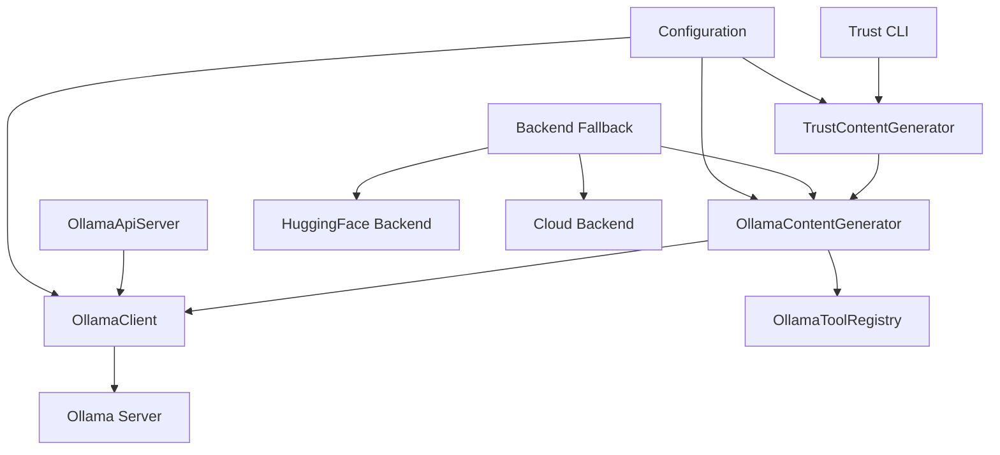
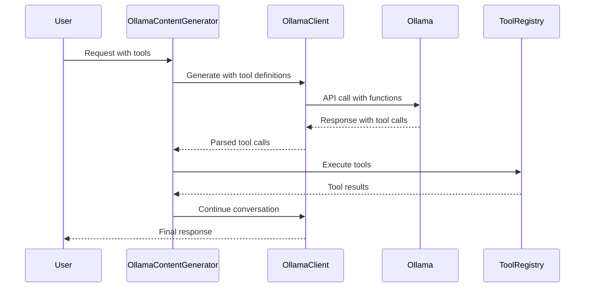

# Ollama Integration Architecture and Usage Guide

> **Trust CLI Ollama Integration**  
> Complete documentation for local model deployment, configuration, and optimization

## Table of Contents

1. [Overview](#overview)
2. [Architecture](#architecture)
3. [Installation and Setup](#installation-and-setup)
4. [Configuration](#configuration)
5. [Backend Fallback System](#backend-fallback-system)
6. [Tool Calling Integration](#tool-calling-integration)
7. [API Server](#api-server)
8. [Performance Optimization](#performance-optimization)
9. [Troubleshooting](#troubleshooting)
10. [Usage Patterns](#usage-patterns)
11. [Migration Guide](#migration-guide)

## Overview

Trust CLI integrates with [Ollama](https://ollama.ai) to provide high-performance local model execution with native tool calling capabilities. This integration replaces the previous node-llama-cpp approach with a more robust, OpenAI-compatible solution.

### Key Benefits

- **🚀 Native Tool Calling**: First-class support for function calling with local models
- **⚡ High Performance**: Optimized for speed with model preheating and connection pooling
- **🔄 Smart Fallback**: Automatic fallback to HuggingFace and cloud APIs when needed
- **🔧 OpenAI Compatible**: Drop-in replacement for OpenAI API calls
- **📊 Resource Management**: Intelligent concurrency control and memory optimization
- **🛠️ Enterprise Ready**: Production-grade features with monitoring and logging

### Supported Models

Trust CLI supports any Ollama-compatible model, with optimized configurations for:

- **Qwen 2.5** (1.5B, 3B, 7B) - Fast and efficient
- **Phi-3.5** (Mini, Medium) - Microsoft's optimized models  
- **Llama 3.2** (1B, 3B, 8B) - Meta's latest models
- **Gemma 2** (2B, 9B, 27B) - Google's open models
- **Custom Models** - Any GGUF model compatible with Ollama

## Architecture

### Component Overview



### Core Components

#### 1. OllamaClient
**File**: `src/trust/ollamaClient.ts`

The foundational client that communicates with Ollama's OpenAI-compatible API.

```typescript
interface OllamaConfig {
  baseUrl?: string;          // Default: http://localhost:11434/v1
  model?: string;            // Default: qwen2.5:1.5b
  timeout?: number;          // Default: 60000ms
  keepAlive?: string;        // Default: 5m
  concurrency?: number;      // Default: 2
  temperature?: number;      // Default: 0.7
  topP?: number;            // Default: 0.9
  repeatPenalty?: number;   // Default: 1.1
}
```

**Key Features**:
- Connection health checking with exponential backoff
- Model availability validation and auto-pulling
- Request queuing and concurrency control
- Streaming response support
- Token usage tracking

#### 2. OllamaContentGenerator
**File**: `src/trust/ollamaContentGenerator.ts`

High-level content generator implementing the ContentGenerator interface.

```typescript
interface OllamaContentGeneratorConfig extends OllamaConfig {
  maxToolCalls?: number;        // Default: 5
  enableToolCalling?: boolean;  // Default: true
  preferredModels?: string[];   // Model preference order
  autoModelSelection?: boolean; // Auto-select best model
}
```

**Capabilities**:
- Automatic tool calling with conversation flow
- Content generation with streaming support
- Token counting and embedding generation
- Conversation history management
- Error handling and recovery

#### 3. OllamaToolRegistry
**File**: `src/trust/ollamaToolRegistry.ts`

Bridges Trust CLI's tool system with Ollama's function calling format.

**Functions**:
- Converts Trust CLI tools to OpenAI function schemas
- Manages tool execution and response formatting
- Provides tool validation and error handling
- Supports dynamic tool registration

#### 4. OllamaApiServer
**File**: `src/trust/ollamaApiServer.ts`

Optional API server providing OpenAI-compatible endpoints for external access.

```typescript
interface ApiServerConfig {
  port?: number;           // Default: 8080
  host?: string;          // Default: localhost
  cors?: boolean;         // Default: true
  apiKey?: string;        // Authentication key
  rateLimit?: {
    requests: number;     // Requests per window
    window: number;       // Window in milliseconds
  };
}
```

## Installation and Setup

### Prerequisites

1. **Install Ollama**
   ```bash
   # macOS
   brew install ollama
   
   # Linux
   curl -fsSL https://ollama.ai/install.sh | sh
   
   # Windows
   # Download from https://ollama.ai/download
   ```

2. **Start Ollama Service**
   ```bash
   ollama serve
   ```

3. **Pull a Model**
   ```bash
   # Recommended starter model (fast, efficient)
   ollama pull qwen2.5:1.5b
   
   # More capable models
   ollama pull qwen2.5:3b
   ollama pull phi3.5:3.8b
   ollama pull llama3.2:3b
   ```

### Trust CLI Configuration

Trust CLI will automatically detect and use Ollama when available. No additional configuration is required for basic usage.

#### Manual Configuration

Create or edit your Trust CLI configuration:

```bash
# Edit configuration
trust config edit
```

```yaml
# .trustcli/config.yaml
ai:
  backends:
    ollama:
      enabled: true
      baseUrl: "http://localhost:11434/v1"
      model: "qwen2.5:1.5b"
      timeout: 60000
      concurrency: 2
      keepAlive: "5m"
    
  fallback:
    enabled: true
    order: ["ollama", "huggingface", "cloud"]
```

## Configuration

### Environment Variables

```bash
# Ollama Configuration
export OLLAMA_HOST="localhost:11434"
export OLLAMA_MODEL="qwen2.5:1.5b"
export OLLAMA_TIMEOUT="60000"
export OLLAMA_KEEP_ALIVE="5m"

# Trust CLI Ollama Integration
export TRUST_OLLAMA_ENABLED="true"
export TRUST_OLLAMA_CONCURRENCY="2"
export TRUST_OLLAMA_MAX_TOOL_CALLS="5"
```

### Model Selection Strategy

Trust CLI uses intelligent model selection based on:

1. **Task Complexity**: Automatically chooses model size based on prompt complexity
2. **Performance Requirements**: Balances speed vs. capability
3. **Resource Availability**: Considers available RAM and CPU
4. **User Preferences**: Respects manually configured model preferences

```typescript
// Configuration example
const config: OllamaContentGeneratorConfig = {
  preferredModels: [
    "qwen2.5:3b",      // Primary choice
    "qwen2.5:1.5b",    // Fallback for speed
    "phi3.5:3.8b"      // Alternative capability
  ],
  autoModelSelection: true,
  maxToolCalls: 5,
  enableToolCalling: true
};
```

## Backend Fallback System

Trust CLI implements a sophisticated backend fallback system:

```
Ollama (Local) → HuggingFace (Local) → Cloud APIs
```

### Fallback Triggers

1. **Ollama Unavailable**: Service not running or unreachable
2. **Model Not Found**: Required model not pulled/available
3. **Resource Constraints**: Insufficient memory or timeout
4. **Error Conditions**: Persistent failures or corruption
5. **Manual Override**: User-specified backend preference

### Fallback Configuration

```yaml
ai:
  fallback:
    enabled: true
    timeout: 30000          # Max time before fallback
    retries: 2              # Retry attempts per backend
    order: ["ollama", "huggingface", "cloud"]
    
    # Backend-specific settings
    ollama:
      enabled: true
      priority: 1
      healthCheck: true
      
    huggingface:
      enabled: true
      priority: 2
      models: ["microsoft/Phi-3.5-mini-instruct"]
      
    cloud:
      enabled: true
      priority: 3
      provider: "openai"
```

### Monitoring Fallback

```bash
# Check backend status
trust status --backends

# View fallback history
trust logs --backend-fallback

# Force specific backend
trust --backend ollama "Your prompt here"
```

## Tool Calling Integration

### Overview

Ollama integration provides native tool calling capabilities, allowing models to:

- Execute shell commands
- Read and write files
- Search the web
- Access databases
- Call external APIs
- Perform complex workflows

### Tool Definition Format

Tools are automatically converted from Trust CLI format to OpenAI function schema:

```typescript
// Trust CLI Tool
interface TrustTool {
  name: string;
  description: string;
  parameters: {
    type: "object";
    properties: Record<string, ParameterDef>;
    required?: string[];
  };
}

// Converted to OpenAI Format
interface OpenAIFunction {
  type: "function";
  function: {
    name: string;
    description: string;
    parameters: {
      type: "object";
      properties: Record<string, PropertyDef>;
      required?: string[];
    };
  };
}
```

### Tool Execution Flow



### Custom Tool Development

```typescript
// Example: Custom weather tool
class WeatherTool {
  name = "get_weather";
  description = "Get current weather for a location";
  
  parameters = {
    type: "object" as const,
    properties: {
      location: {
        type: "string",
        description: "City or location name"
      },
      units: {
        type: "string",
        enum: ["celsius", "fahrenheit"],
        description: "Temperature units"
      }
    },
    required: ["location"]
  };

  async execute(args: { location: string; units?: string }) {
    // Implement weather API call
    return {
      location: args.location,
      temperature: 22,
      units: args.units || "celsius",
      condition: "sunny"
    };
  }
}

// Register tool
toolRegistry.register(new WeatherTool());
```

## API Server

### Starting the API Server

```typescript
import { OllamaApiServer } from '@trust-cli/core';

const server = new OllamaApiServer(config, toolRegistry);

await server.start({
  port: 8080,
  host: 'localhost',
  cors: true,
  apiKey: 'your-api-key',
  rateLimit: {
    requests: 100,
    window: 60000 // 1 minute
  }
});
```

### API Endpoints

#### Chat Completions
```http
POST /v1/chat/completions
Content-Type: application/json
Authorization: Bearer your-api-key

{
  "model": "qwen2.5:1.5b",
  "messages": [
    {
      "role": "user",
      "content": "List files in current directory"
    }
  ],
  "tools": [
    {
      "type": "function",
      "function": {
        "name": "list_directory",
        "description": "List files in directory",
        "parameters": {
          "type": "object",
          "properties": {
            "path": {
              "type": "string",
              "description": "Directory path"
            }
          }
        }
      }
    }
  ],
  "temperature": 0.7,
  "max_tokens": 1000
}
```

#### Streaming Responses
```http
POST /v1/chat/completions
Content-Type: application/json

{
  "model": "qwen2.5:1.5b",
  "messages": [...],
  "stream": true
}
```

### Client Libraries

#### Python
```python
import openai

client = openai.OpenAI(
    api_key="your-api-key",
    base_url="http://localhost:8080/v1"
)

response = client.chat.completions.create(
    model="qwen2.5:1.5b",
    messages=[
        {"role": "user", "content": "Hello, world!"}
    ]
)
```

#### JavaScript/Node.js
```javascript
import OpenAI from 'openai';

const client = new OpenAI({
  apiKey: 'your-api-key',
  baseURL: 'http://localhost:8080/v1'
});

const response = await client.chat.completions.create({
  model: 'qwen2.5:1.5b',
  messages: [
    { role: 'user', content: 'Hello, world!' }
  ]
});
```

## Performance Optimization

### Model Preheating

Trust CLI automatically preheats models for faster first response:

```typescript
// Automatic preheating on initialization
await ollamaClient.preheatModel();

// Manual preheating
await ollamaClient.preheatModel("qwen2.5:3b");
```

### Connection Pooling

```typescript
const config: OllamaConfig = {
  concurrency: 4,        // Max concurrent requests
  keepAlive: "10m",      // Keep model loaded
  timeout: 30000,        // Request timeout
};
```

### Resource Monitoring

```bash
# Monitor Ollama resource usage
trust monitor --ollama

# View performance metrics
trust metrics --backend ollama

# Optimize model selection
trust optimize --models
```

### Memory Management

```yaml
# Model-specific memory settings
models:
  qwen2.5:1.5b:
    contextSize: 4096
    batchSize: 512
    threads: 4
    
  qwen2.5:3b:
    contextSize: 8192
    batchSize: 256
    threads: 8
```

### Performance Tuning Guidelines

1. **Model Selection**
   - Use 1.5B models for simple tasks
   - Use 3B+ models for complex reasoning
   - Consider quantization levels (Q4_K_M, Q8_0)

2. **Hardware Optimization**
   - 8GB+ RAM recommended for 3B models
   - SSD storage for faster model loading
   - Multi-core CPU for parallel processing

3. **Configuration Tuning**
   - Adjust concurrency based on available cores
   - Optimize context size for your use case
   - Fine-tune timeout values

## Troubleshooting

### Common Issues

#### 1. Ollama Service Not Running
```bash
# Error: Connection refused
# Solution: Start Ollama service
ollama serve

# Check if running
curl http://localhost:11434/api/tags
```

#### 2. Model Not Found
```bash
# Error: Model not available
# Solution: Pull the model
ollama pull qwen2.5:1.5b

# List available models
ollama list
```

#### 3. Memory Issues
```bash
# Error: Out of memory
# Solutions:
# 1. Use smaller model
ollama pull qwen2.5:1.5b

# 2. Reduce context size
trust config set ollama.contextSize 2048

# 3. Lower concurrency
trust config set ollama.concurrency 1
```

#### 4. Slow Performance
```bash
# Check model status
trust status --verbose

# Monitor resource usage
trust monitor --ollama

# Optimize configuration
trust optimize --auto
```

### Debug Mode

```bash
# Enable debug logging
export DEBUG=trust:ollama*

# Run with verbose output
trust --verbose --debug "Your prompt"

# Check logs
trust logs --debug --backend ollama
```

### Health Checks

```bash
# Complete health check
trust health --all

# Ollama-specific checks
trust health --ollama

# Connection test
trust test-connection --ollama
```

## Usage Patterns

### Basic Usage

```bash
# Simple query (auto-detects and uses Ollama)
trust "What files are in the current directory?"

# Force Ollama backend
trust --backend ollama "Analyze this code file"

# With specific model
trust --model qwen2.5:3b "Complex reasoning task"
```

### Interactive Mode

```bash
# Start interactive session
trust interactive

# Check current backend
> /status

# Switch backend
> /backend ollama

# Set model
> /model qwen2.5:1.5b
```

### Programmatic Usage

```typescript
import { TrustContentGenerator } from '@trust-cli/core';

const generator = new TrustContentGenerator();
await generator.initialize();

// Generate content with Ollama
const response = await generator.generateContent({
  model: 'qwen2.5:1.5b',
  contents: [{
    parts: [{ text: 'List files in current directory' }],
    role: 'user'
  }]
});

console.log(response.text);
```

### Tool Calling Example

```typescript
// Define tools
const tools = [
  {
    name: 'read_file',
    description: 'Read file contents',
    parameters: {
      type: 'object',
      properties: {
        path: { type: 'string', description: 'File path' }
      },
      required: ['path']
    }
  }
];

// Generate with tools
const response = await generator.generateContent({
  model: 'qwen2.5:1.5b',
  contents: [{
    parts: [{ text: 'Read the package.json file and summarize it' }],
    role: 'user'
  }],
  tools
});
```

### Streaming Responses

```typescript
const stream = generator.generateContentStream({
  model: 'qwen2.5:1.5b',
  contents: [{
    parts: [{ text: 'Write a long story about AI' }],
    role: 'user'
  }]
});

for await (const chunk of stream) {
  process.stdout.write(chunk.text || '');
}
```

### Batch Processing

```typescript
const prompts = [
  'Analyze file1.js',
  'Analyze file2.js', 
  'Analyze file3.js'
];

const results = await Promise.all(
  prompts.map(prompt => 
    generator.generateContent({
      model: 'qwen2.5:1.5b',
      contents: [{ parts: [{ text: prompt }], role: 'user' }]
    })
  )
);
```

## Migration Guide

### From node-llama-cpp

The Ollama integration replaces the previous node-llama-cpp implementation:

#### Before (node-llama-cpp)
```typescript
import { LlamaCpp } from 'node-llama-cpp';

const llama = new LlamaCpp({
  modelPath: './models/model.gguf',
  contextSize: 4096
});

const response = await llama.generate('Hello world');
```

#### After (Ollama)
```typescript
import { OllamaContentGenerator } from '@trust-cli/core';

const generator = new OllamaContentGenerator(config, toolRegistry, {
  model: 'qwen2.5:1.5b',
  baseUrl: 'http://localhost:11434/v1'
});

const response = await generator.generateContent({
  model: 'qwen2.5:1.5b',
  contents: [{ parts: [{ text: 'Hello world' }], role: 'user' }]
});
```

### Configuration Migration

#### Old Configuration
```yaml
llama:
  modelPath: "./models/phi-3.5-mini.gguf"
  contextSize: 4096
  threads: 4
```

#### New Configuration
```yaml
ai:
  backends:
    ollama:
      enabled: true
      model: "phi3.5:3.8b"
      baseUrl: "http://localhost:11434/v1"
      contextSize: 4096
```

### Breaking Changes

1. **Model Loading**: Models are now managed by Ollama service
2. **API Format**: OpenAI-compatible format instead of custom
3. **Tool Calling**: Native function calling instead of GBNF grammar
4. **Streaming**: Server-sent events instead of async generators
5. **Configuration**: New YAML structure and environment variables

### Migration Checklist

- [ ] Install Ollama service
- [ ] Pull required models (`ollama pull <model>`)
- [ ] Update configuration files
- [ ] Test basic functionality
- [ ] Verify tool calling works
- [ ] Update any custom integrations
- [ ] Remove old node-llama-cpp dependencies

---

## Additional Resources

- [Ollama Official Documentation](https://ollama.ai/docs)
- [Trust CLI Configuration Guide](./configuration.md)
- [Tool Development Guide](./tools-api.md)
- [Performance Optimization](./performance.md)
- [Troubleshooting Guide](./troubleshooting.md)

## Support

For issues with Ollama integration:

1. Check this documentation
2. Review [troubleshooting section](#troubleshooting)
3. Check [GitHub Issues](https://github.com/trust-cli/trust-cli/issues)
4. Join our [Discord community](https://discord.gg/trust-cli)

---

**Last Updated**: January 2025  
**Version**: 1.0.0  
**Compatibility**: Trust CLI v2.0+, Ollama v0.1.0+